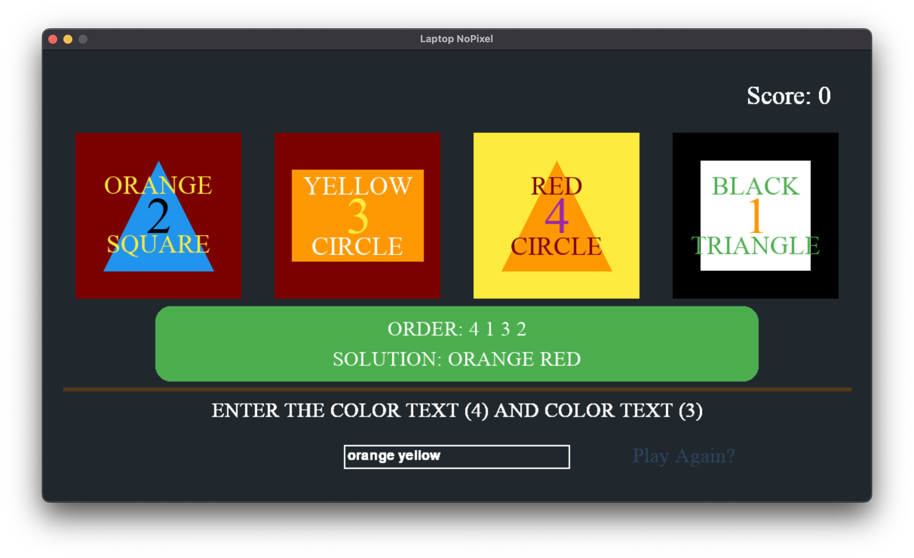

# Laptop mini-game from NoPixel's GTA server

Your task is to keep "hacking" puzzles as long as you can.

At the beginning of each hack you are shown the numbers belonging to each unit. During the hacking phase every unit will be referenced with this number in the task description, meaning you must memorize them.

In the hacking phase 2 random properties of the four units are given to you.
The available properties are the following:
- background color
- shape color
- text color
- number color
- shape
- color text
- shape text

Once your time is up or your solution is incorrect (typos are not tolerated)
the original order of the numbers and the solution will be displayed.

If you successfully accomplished the puzzle a new random
order with random tasks is generated for you to solve.
